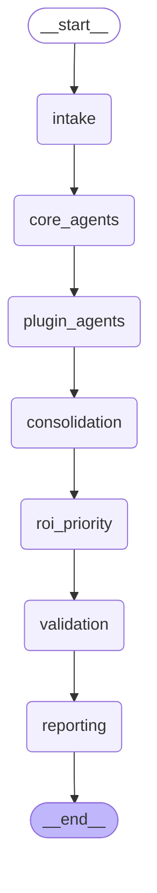

# LangGraph Execution Architecture

```mermaid
---
config:
  flowchart:
    curve: linear
---
graph TD;
	__start__([<p>__start__</p>]):::first
	intake(intake)
	core_agents(core_agents)
	plugin_agents(plugin_agents)
	consolidation(consolidation)
	roi_priority(roi_priority)
	validation(validation)
	reporting(reporting)
	__end__([<p>__end__</p>]):::last
	__start__ --> intake;
	consolidation --> roi_priority;
	core_agents --> plugin_agents;
	intake --> core_agents;
	plugin_agents --> consolidation;
	roi_priority --> validation;
	validation --> reporting;
	reporting --> __end__;
	classDef default fill:#f2f0ff,line-height:1.2
	classDef first fill-opacity:0
	classDef last fill:#bfb6fc

```
